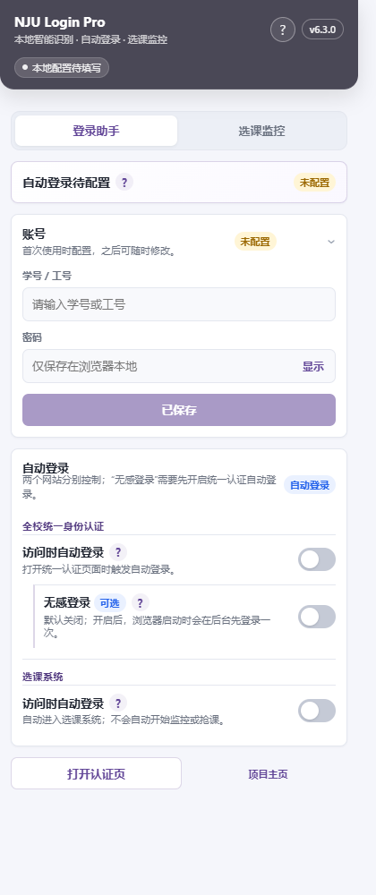
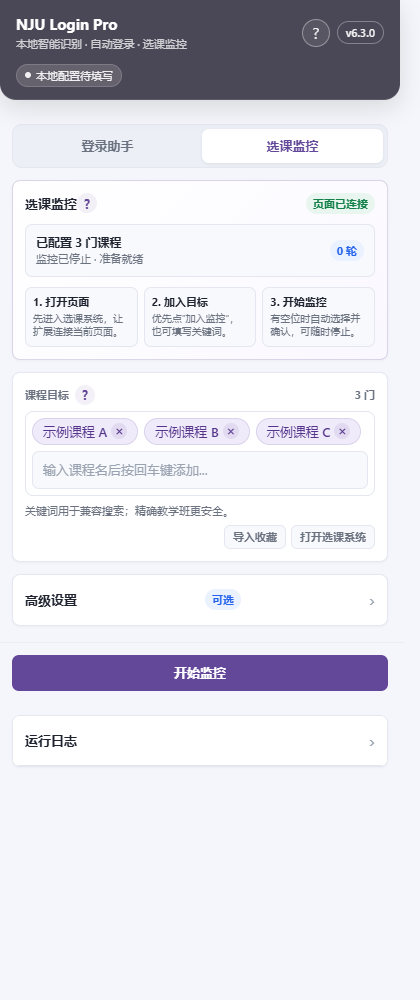
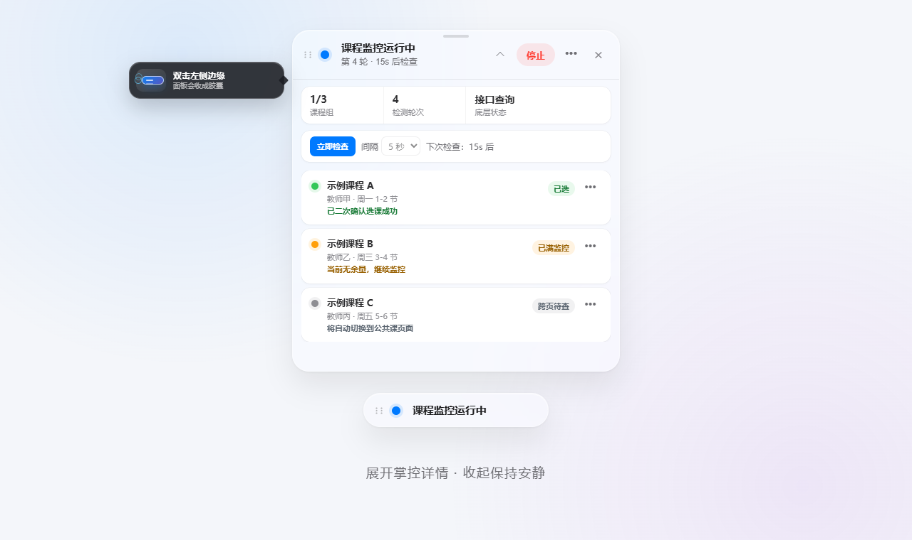

<div align="center">

  

  # NJU Login Pro

  <sub>Microsoft Edge 商店名称：NJU 自动登录助手</sub>

  南京大学统一身份认证与选课系统的本地登录、验证码处理和课程监控扩展

  [](https://microsoftedge.microsoft.com/addons/detail/hebfkinlcalfnmeeeaciaghoialpmnfp)
  [](https://github.com/treehey/NJU-Login-Pro/releases/latest)
  [](LICENSE)

  [安装与上手](#安装) · [支持范围](#支持范围) · [隐私与权限](#隐私与权限) · [问题排查](docs/troubleshooting.md)

</div>

> [!IMPORTANT]
> 本项目是非官方开源工具，与南京大学无隶属或授权关系。使用前请遵守学校系统规则。页面或验证码变化时，自动化可能失效并转为人工处理。

## 这是什么

NJU Login Pro 面向需要访问南京大学统一身份认证和选课系统的用户，提供两类本地自动化：

- 在统一身份认证页处理当前拼图滑块；页面回退为旧版图形验证码时，使用本地 CNN/OCR 兼容路径。
- 在选课系统处理中文点击验证码，并在登录后按精确教学班或课程关键词监控选课名额。

验证码推理在浏览器本地完成，不使用第三方打码服务或大模型 API。自动化是有边界的辅助工具，不保证页面变化后的登录或选课一定成功。

## 界面预览

以下画面均使用空白配置或示例课程，不包含真实账号和教学班信息。

| 登录助手 | 选课监控配置 | 课程页雷达与胶囊 |
| --- | --- | --- |
|  |  |  |

## 安装

### Edge 商店（推荐）

打开 [Microsoft Edge Add-ons](https://microsoftedge.microsoft.com/addons/detail/hebfkinlcalfnmeeeaciaghoialpmnfp)，选择“获取”。商店安装可以自动接收已发布版本的更新。

### Chrome 或 Edge 手动安装

1. 从 [GitHub Releases](https://github.com/treehey/NJU-Login-Pro/releases/latest) 下载 `NJU-Login-Pro-v*.zip`，不要下载 GitHub 自动生成的 `Source code`。
2. 将 ZIP 解压到固定目录，并确认目录根部直接包含 `manifest.json`。
3. 打开浏览器扩展管理页（Chrome 为 `chrome://extensions`，Edge 为 `edge://extensions`），开启“开发者模式”。
4. 选择“加载已解压的扩展程序”，然后选中刚才解压的目录。
5. （可选）在扩展菜单中固定 NJU Login Pro，方便打开面板。

当前未提供 Firefox 发布包，也未将 Firefox 列入本项目的验收支持范围。

## 三步开始使用

1. 打开扩展，在“登录助手”中填写学号或工号与密码并保存。
2. 按需要分别开启“统一认证自动登录”和“选课系统自动登录”。“无感登录”默认关闭，开启后会在浏览器启动时先在后台登录一次。
3. 访问支持的学校页面。进入选课页后，优先在目标教学班旁选择“加入监控”，或在扩展的“选课监控”中填写课程关键词，再在选课页的课程雷达中点击“开始监控”。

课程雷达可以开始或停止监控、空闲时立即检查、调整停止态间隔、跳转到目标所在课程页、移除单个目标或确认后清空全部目标。暂时不想占屏幕时可收成胶囊或只隐藏面板；“关闭选课页增强”才会连同行内按钮和布局增强一起关闭。

详细步骤见 [用户使用指南](docs/user-guide.md)。

> [!NOTE]
> 课程监控需要保持选课页面打开，只会在明确验证教学班已选后记录成功。它不保证一定抢到课程，不会默认退掉保底课程，也不会在浏览器重启后自行恢复真实提交。

## 支持范围

### 浏览器

| 浏览器 | 当前支持方式 | 说明 |
| --- | --- | --- |
| Microsoft Edge | Edge 商店或加载未打包扩展 | 推荐使用商店版本 |
| Google Chrome | 手动加载 Release 压缩包 | 解压后通过开发者模式加载 |
| Firefox | 未列入当前支持范围 | 没有对应发布包和验收承诺 |

### 网站

| 网站 | 支持内容 | 失败时的处理 |
| --- | --- | --- |
| `authserver.nju.edu.cn` | 拼图滑块、账号密码填写和提交；兼容旧版四位图形验证码 | 有界处理，无法完成时保留官方验证供人工完成 |
| `xk.nju.edu.cn` 登录页 | 中文点击验证码、账号密码填写和提交 | 三目标、背景变化或置信度不足时有限换图重试，之后转人工 |
| `xk.nju.edu.cn` 选课页 | 精确教学班或关键词匹配、余量监控、选择、确认和结果验证 | 登录失效时保存会话检查点；网络或页面异常时退避或转人工 |

## 自动恢复与人工接管

课程监控登录失效时，扩展会先保存当前任务的会话检查点，并暂停监控。完成可见登录、重新识别到当前选课轮次后，扩展才会尝试回到课程页、点击当前轮次入口并先验证任务状态。

自动恢复有明确期限和停止条件：登录超时、入口不可用或变化、连续恢复失败、页面状态无法确认时，会停止自动跳转并提示人工处理。它不会无条件点击登录按钮，也不会绕过验证码或把不确定的页面状态当作成功。浏览器会话结束后，运行快照不会作为长期任务保留。

## 隐私与权限

### Manifest 权限

| 声明 | 用途 |
| --- | --- |
| `storage` | 在扩展本地保存用户配置，并在当前浏览器会话中保存有限恢复状态 |
| `alarms` | 限制可选认证预热的等待时间；不用于周期性保活 |
| `https://authserver.nju.edu.cn/*` | 在统一身份认证页面执行已启用的登录辅助 |
| `https://xk.nju.edu.cn/*` | 在选课登录和课程页面执行已启用的登录、监控与选课操作 |

### 本地存储

账号、密码、课程配置和运行状态的保存范围如下：

| 项目 | 用途 | 保存位置 |
| --- | --- | --- |
| 账号、密码和登录开关 | 在用户开启对应功能时填入学校官方页面 | 扩展 `storage.local` |
| 课程目标与监控配置 | 保存精确教学班、关键词和监控选项 | 扩展 `storage.local` |
| 认证预热状态 | 支持用户主动开启的一次性会话预热 | 扩展 `storage.session` |
| 课程监控运行快照 | 支持同一标签页刷新或登录失效后的有限恢复 | 扩展 `storage.session` |

- 扩展没有 `cookies` 或 `history` 权限，不读取、复制或修改 Cookie 值，也不访问浏览器历史记录。
- 验证码图像在浏览器本地推理，不上传到第三方打码服务、模型 API 或项目维护者。
- 密码保存在扩展本地存储中，但**没有额外加密**；不要在公共或不受信任的浏览器配置文件中保存密码。
- 向学校页面提交登录信息或选课操作仍属于该网站自己的正常请求；扩展不向开发者或第三方转发这些数据。

完整的数据处理、网络请求和用户控制说明见 [隐私政策](PRIVACY.md)；安全问题请参阅 [安全政策](SECURITY.md)。

## 问题排查

- [用户使用指南](docs/user-guide.md)：安装、首次配置、登录和课程监控步骤。
- [常见问题与排查](docs/troubleshooting.md)：安装无反应、验证码变化、监控找不到目标和登录恢复问题。
- [更新记录](CHANGELOG.md)：当前版本与历史行为变化。

提交问题时请提供脱敏后的浏览器、页面路径、扩展版本和可复现步骤。不要上传密码、Cookie、完整请求体、未脱敏截图或验证码原图。

## 开发与验证

项目运行时代码无需编译，要求 Node.js 20 或更高版本。常用命令：

```powershell
npm test
npm run package:release
```

开发环境、架构、测试和发布细节见 [开发文档](docs/development.md)、[架构文档](docs/architecture.md)、[测试策略](docs/testing.md) 和 [发布流程](docs/releasing.md)。提交改动前请阅读 [贡献指南](CONTRIBUTING.md)。

## 许可证

项目源码采用 [MIT License](LICENSE)。随扩展分发的第三方运行时及其许可信息见 [第三方软件说明](THIRD_PARTY_NOTICES.md)。
