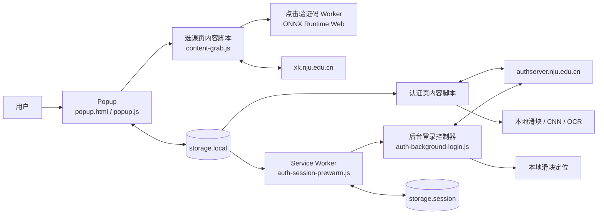

# 架构

NJU Login Pro 是 Manifest V3 浏览器扩展。发布包内包含全部运行代码、模型和 WASM 资源，不依赖项目自建服务器。

## 运行时关系

## 模块职责

| 区域 | 主要文件 | 职责 |
| --- | --- | --- |
| 扩展入口 | `manifest.json` | 权限、内容脚本、后台 Worker 和可访问资源 |
| 用户界面 | `popup.html`, `popup.js` | 配置、状态、课程关键词、人工诊断入口 |
| 认证快路径 | `auth-login-fast.js` | 页面早期读取配置并启动认证检查 |
| 认证滑块 | `auth-slider-captcha.js` | 挑战解析、缺口定位、轨迹生成和验证协议 |
| 后台预认证 | `auth-session-prewarm.js`, `auth-background-login.js` | 每浏览器会话一次的可选后台认证、超时和取消 |
| 旧版认证兼容 | `content.js`, `captcha-cnn.js`, `tesseract.min.js` | 四位图形验证码 CNN/OCR 路径 |
| 选课页面 | `content-grab.js` | 点击验证码控制、登录表单和课程监控 |
| 点击验证码推理 | `click-captcha-worker.js`, `assets/click-captcha-model.onnx` | 本地预处理、匹配和置信门槛 |
| 发布打包 | `scripts/build-package.ps1` | 按白名单复制运行文件并检查 ZIP |

## 数据和信任边界

- 长期用户配置存入 `chrome.storage.local`；密码不由扩展额外加密。
- 后台预认证状态存入 `chrome.storage.session`，不作为长期配置。
- 认证请求只面向 `authserver.nju.edu.cn`，选课逻辑只面向 `xk.nju.edu.cn`。
- 浏览器维护站点 Cookie；扩展不申请 `cookies` 权限，也不读取 Cookie 值。
- 模型推理在内容脚本、Worker 或扩展后台中本地执行。
- `data/`、`tests/`、`tools/`、`docs/` 和开发脚本不得进入正式发布 ZIP。

## 自动操作保护

自动化必须满足“页面属于已授权站点、控件形态符合预期、用户开关允许、输入完整、置信条件通过”后才能提交或点击。异常状态应停止、换图或转人工，不应通过增加无限重试掩盖问题。

后台预认证还必须遵守：默认关闭、每浏览器会话最多一次、30 秒超时、可见认证页优先、退出后抑制再次运行。

## 设计约束

1. 不引入远程代码或第三方验证码服务。
2. 新增权限必须有明确功能必要性，并同步更新隐私政策和商店文案。
3. 正式包只由显式白名单构成；不要直接压缩仓库根目录。
4. 线上页面检查只用于人工验收；CI 不使用真实账号或生产认证请求。
5. 历史样本用于回归，不能把开发集结果表述为未知验证码成功率。
