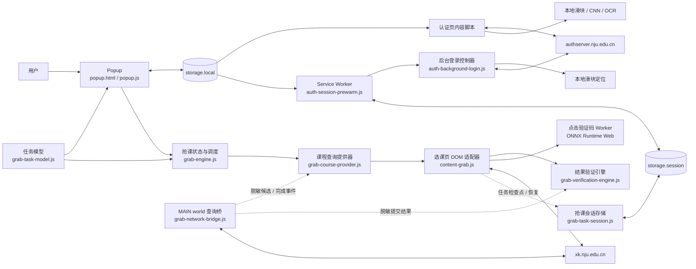

# 架构

NJU Login Pro 是 Manifest V3 浏览器扩展。发布包内包含全部运行代码、模型和 WASM 资源，不依赖项目自建服务器。

## 运行时关系

## 模块职责

| 区域 | 主要文件 | 职责 |
| --- | --- | --- |
| 扩展入口 | `manifest.json` | 权限、内容脚本、后台 Worker 和可访问资源 |
| 用户界面 | `popup.html`, `popup.js` | 配置、状态、关键词与精确教学班目标、人工诊断入口 |
| 抢课任务模型 | `grab-task-model.js` | 版本化配置、旧关键词迁移、目标去重、精确教学班身份和持久化白名单 |
| 认证快路径 | `auth-login-fast.js` | 页面早期读取配置并启动认证检查 |
| 认证滑块 | `auth-slider-captcha.js` | 挑战解析、缺口定位、轨迹生成和验证协议 |
| 后台预认证 | `auth-session-prewarm.js`, `auth-background-login.js` | 每浏览器会话一次的可选后台认证、超时和取消 |
| 旧版认证兼容 | `content.js`, `captcha-cnn.js`, `tesseract.min.js` | 四位图形验证码 CNN/OCR 路径 |
| 抢课引擎 | `grab-engine.js` | 不可变任务配置、候选状态、提交验证、瞬时错误退避、取消代次和固定周期调度 |
| 课程查询提供器 | `grab-course-provider.js` | 正常规模任务的全目标串行查询、超出安全上限后的分批选择、网络候选归一化、可用教学班 DOM 物化、无模板时的 DOM 回退，以及不含课程内容和请求数据的聚合诊断 |
| 结果验证引擎 | `grab-verification-engine.js` | 通过单一 `evaluate()` interface 统一 DOM 已选证据、页面反馈、提交响应和精确教学班异步状态；输出标准结果或保持待定 |
| 选课网络桥 | `grab-network-bridge.js` | 在 MAIN world 观察既有请求；内部按 `queryScope` 分开复用原生课程查询模板并只返回课程候选白名单，同时传递脱敏提交结果 |
| 抢课会话恢复 | `grab-task-session.js` | 在 Service Worker 中校验并保存版本化运行快照、登录恢复检查点、标签页执行权和修订号，页面重载后恢复任务 |
| 选课页面 | `content-grab.js`, `grab-page-ui.css` | 课程 DOM 适配器、教学班加入与逐目标状态、可折叠课程雷达、可整体关闭的选课增强控件、点击验证码控制，以及登录页、轮次预备页和课程页之间的同标签页任务恢复协调 |
| 点击验证码推理 | `click-captcha-worker.js`, `assets/click-captcha-model.onnx` | 本地预处理、匹配和置信门槛 |
| 发布打包 | `scripts/build-package.ps1` | 按白名单复制运行文件并检查 ZIP |

## 数据和信任边界

- 长期用户配置存入 `chrome.storage.local`；抢课配置使用版本化目标 schema，密码不由扩展额外加密。
- 后台预认证和运行中抢课任务的白名单快照存入 `chrome.storage.session`，不作为长期配置。
- 认证请求只面向 `authserver.nju.edu.cn`，选课逻辑只面向 `xk.nju.edu.cn`。
- 浏览器维护站点 Cookie；扩展不申请 `cookies` 权限，也不读取 Cookie 值。
- 选课网络桥不读取 Cookie。课程查询时只在 MAIN world 内部复用学校页面最近一次原生 XHR 的请求体和请求头，替换搜索词与分页；token、学号、完整查询体和加密提交参数不会跨越到内容脚本。跨 world 只传递批次、课程/教学班 ID、课程展示字段、容量和标准状态白名单。
- 接口扫描按顺序串行执行，同一时间不会并发轰炸学校接口。默认安全上限为每轮 12 个目标，因此常见的 5 门任务会在首轮全部检查；只有超过上限时才按优先级分批轮转。接口发现可用候选后才用精确课程号驱动原生 DOM 渲染，提交仍走页面原生控件。扫描结果附带接口、接口加 DOM 物化、DOM 回退或错误四类聚合诊断；运行快照只保存轮次、耗时和数量，不保存查询词、课程内容或请求数据。
- 模型推理在内容脚本、Worker 或扩展后台中本地执行。
- `data/`、`tests/`、`tools/`、`docs/` 和开发脚本不得进入正式发布 ZIP。

## 自动操作保护

自动化必须满足“页面属于已授权站点、控件形态符合预期、用户开关允许、输入完整、置信条件通过”后才能提交或点击。异常状态应停止、换图或转人工，不应通过增加无限重试掩盖问题。

后台预认证还必须遵守：默认关闭、每浏览器会话最多一次、30 秒超时、可见认证页优先、退出后抑制再次运行。

抢课提交必须遵守：确认弹窗和 `volunteer.do` 接受请求都不等于成功；只有重新观察到对应教学班已选，或该教学班的 `studentstatus.do` 返回最终成功，才能记录成功。这些证据和失败分类必须经过 VerificationEngine，DOM Adapter 和未来 Native Submit Adapter 不得各自定义成功语义。捕获并分类本次结果后，可关闭这次操作新产生的学校结果框以释放页面遮罩；登录和验证码交互不在自动关闭范围。提交结果不明确时进入验证期，期间不得重复提交；停止或重启任务后，旧运行代次不得继续点击或写入状态。网络和服务端瞬时错误按目标退避，限流按整个任务退避；恢复时间随会话快照保存，页面重载不会绕过保护窗口。

课程冲突属于候选教学班级别的永久失败，而不是瞬时错误。`GrabEngine` 会记录稳定候选 ID，同一轮继续尝试目标的其他教学班，后续轮次及任务恢复后跳过已冲突候选。如果仍有未冲突但满员的候选，目标保持监控；仅当所有候选均被排除时才进入 `BLOCKED`，避免冲突弹窗被反复触发。

选课登录失效时，GrabEngine 只进入 `PAUSED_AUTH`。页面任务协调层先保存同一标签页的任务租约、白名单快照和选课站内返回路径，再进入选课系统原登录页；自动或人工登录完成后，先识别轮次预备页并持久化 `ENTERING_COURSE`，再调用站点自己的 `#courseBtn` 进入实际课程页。扩展不读取或构造入口 token。课程页通过同一 `restore()` interface 先扫描验证再恢复任务；重复入口或结构异常转人工，连续登录恢复也有次数上限，统一认证预热状态不会被重置。

课程目标分为兼容的关键词目标和精确教学班目标。精确目标由选课页面提取，并以批次、教学班类别和 `teachingClassId` 组成身份；引擎和 DOM 适配器都会拒绝同名但 ID 不同的候选。

## 设计约束

1. 不引入远程代码或第三方验证码服务。
2. 新增权限必须有明确功能必要性，并同步更新隐私政策和商店文案。
3. 正式包只由显式白名单构成；不要直接压缩仓库根目录。
4. 线上页面检查只用于人工验收；CI 不使用真实账号或生产认证请求。
5. 历史样本用于回归，不能把开发集结果表述为未知验证码成功率。
