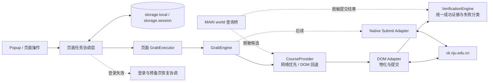

# 抢课模块改进方案

## 文档状态

- 状态：执行中
- 开发基线：`c77414f feat: harden course grab state and verification`
- 开发分支：`codex/grab-engine`
- 集成目标：`dev`
- 发布目标：由 `dev` 提交版本 PR 到 `main`

本文档记录抢课模块的事实依据、设计约束、实施阶段和验收条件。代码行为、测试和本文档必须同步更新；聊天记录不作为长期设计依据。

## 目标

抢课改进按以下优先级推进：

1. 正确性：只有服务端结果已经反映为对应教学班选中，才能记录成功。
2. 实际成功率：避免漏扫候选教学班、无效等待、错误重试和重复提交。
3. 稳定性：停止、重启、页面刷新、登录失效和网络异常后状态可控。
4. 可用性：用户能够直接选择精确教学班，并看懂当前状态和失败原因。
5. 可维护性：复杂行为集中在小 interface 后，通过同一 interface 做生产调用和离线测试。

以下内容不属于当前目标：

- 通过无限降低轮询间隔或暴力并发提高请求量；
- 绕过学校身份认证、验证码、限流或选课规则；
- 默认自动退掉保底课程再抢高优先级课程；
- 在没有真实请求证据时猜测加密参数或服务端错误码。

## 已确认的现状

历史实现存在以下问题：

- 点击确认弹窗后立即写入 `successCourses`，可能产生假成功；
- 名称第一次匹配后就从待查列表移除，可能漏掉后续同名教学班；
- 专业课第一个教学班提交失败后不再尝试其他班；
- 满员、冲突、规则限制、登录失效和未知错误被压缩成同一种状态；
- 任务只保存在页面内容脚本内存中，页面刷新后丢失；
- Popup 使用剩余目标数作为总数，并可能把运行快照写回用户配置；
- 轮询周期是“本轮耗时 + 配置间隔”；
- 缺少针对抢课状态、竞态和提交失败的自动化测试。

仓库保存的选课站点脚本还显示了以下 HTTP 端点：

| 用途 | 已观察到的端点 |
| --- | --- |
| 课程查询 | `/elective/course.do`, `/elective/queryCourse.do`, `/elective/programCourse.do` |
| 可选性检查 | `/util/canchoose.do` |
| 选课提交 | `/elective/volunteer.do` |
| 异步处理状态 | `/elective/studentstatus.do` |
| 已选或返回结果 | `/elective/returnResults.do`, `/elective/courseResult.do` |

下载的登录后页面、专业课展开 DOM、公共课 DOM、收藏页 DOM 和刷新 HAR 已确认：

- 教学班按钮使用 `data-tcid`，详情链接使用 `data-teachingclassid`；
- 专业课的多个教学班位于同一 `course-jxb-container-tr` 内，但每班有独立 `.jxb-item`；
- 公共课每个教学班对应独立 `.course-tr`；可选行通过 `.cv-choice[data-tcid]` 提交，已满行没有选择按钮，但仍可从 `.cv-jxb-detail[data-teachingclassid]` 读取精确教学班 ID；
- 公共课教师和时间地点分别位于 `.jsmc`、`.sjdd`，已据此补齐目标展示信息；
- 收藏页同样以独立 `.course-tr` 表示教学班；满员行仍保留 `.cv-choice.sc-add.cv-disabled[data-tcid]` 链接，因此必须同时检查禁用 class、ARIA 状态和“已满”文本，不能只读取原生 `disabled` 属性；
- 查询 `programCourse.do` 的表单字段为 `querySetting`；
- 提交 `volunteer.do` 的表单字段为加密后的 `addParam` 和 `studentCode`；
- 页面加密前的提交对象包含 `operationType`、`studentCode`、`electiveBatchCode`、`teachingClassId`、`courseKind` 和 `teachingClassType`；
- `volunteer.do` 返回 `code=1` 只表示进入异步处理；页面随后按对应 `teachingClassId` 每秒查询 `studentstatus.do`，最多十次；其中 `code=0` 表示处理中、`code=1` 表示成功、`code=-1` 表示失败；
- HAR 捕获到 `volunteer.do` 的 `code=0` 和“不在选课开放时间范围内”消息，证明提交端点还会直接拒绝请求；
- `code=302` 会触发页面清除 token 并返回登录入口。

请求使用页面 `sessionStorage.token`，提交参数 `addParam` 经过页面 `aesUtil.encrypt()`。当前查询桥会在 MAIN world 内部按 `queryScope` 分类缓存原生课程查询模板，避免在“专业”页面用专业课接口搜索收藏或公共课；按目标替换 `queryContent` 与分页后串行复用。某分类尚未捕获模板时，目标进入“等待分类”而不是“暂未找到”；用户打开过对应分类后，同一页面会话内即可在其他分类继续定向查询。token、学号和完整查询体不会传给内容脚本。提交接口仍只观察页面自身已经发出的请求及脱敏结果，不复制加密参数，也不自行调用提交接口；原生网络提交仍需更多已选结果和限流证据。

## 核心不变量

以下规则必须由实现和测试共同保证：

1. **确认按钮不是成功证据。** 点击“确认”只表示请求可能已经发出。
2. **成功必须二次验证。** 只有对应教学班重新显示为“退选/已选”、已选课程端点明确包含该教学班，或对应 `teachingClassId` 的 `studentstatus.do` 返回最终成功，才能进入 `SELECTED`。
3. **未知提交不得立即重试。** POST 超时、页面重绘或没有明确返回时进入 `UNKNOWN_COMMIT`，先验证，后决定是否重试。
4. **配置目标不可变。** 运行期间分别派生剩余目标和成功目标，不能删除或覆盖原始配置。
5. **所有候选先收集后决策。** 同一目标名称对应的普通课、收藏课和专业课教学班都必须参与本轮判断。
6. **旧运行代次不能产生副作用。** 停止或重启后，旧异步流程不得继续点击、确认、写状态或安排定时器。
7. **同一目标同一时刻最多一个提交。** 在没有服务端并发证据前，全局提交也保持串行。
8. **轮询不重叠、不追赶突发。** 下一轮根据本轮耗时扣减等待时间，但必须保留最小休息时间。
9. **无法精确确认时宁可不报成功。** 安全的漏报优先于错误的成功提示或错误教学班提交。

## 模块设计

### 运行时关系



### GrabEngine

`grab-engine.js` 是抢课行为的深模块。调用者只需要学习以下 interface：

```js
const engine = createGrabEngine({ adapter, ...dependencies });

engine.start(courseTargets, intervalMs);
engine.restore(runtimeSnapshot);
engine.stop(reason);
engine.getSnapshot();
```

该 interface 后隐藏：

- 目标状态迁移；
- 候选排序和逐班尝试；
- 提交结果分类；
- 未知提交保护；
- 分类瞬时错误退避及恢复检查点；
- 运行代次和取消；
- 不重叠的固定周期调度；
- 不可变配置与派生进度。

### Course Adapter seam

GrabEngine 依赖的 adapter interface 为：

```js
adapter.scan(targets, context) -> Map<targetId, Candidate[]>
adapter.attempt(candidate, context) -> AttemptResult
```

这是一个真实 seam，因为存在多种合理 adapter：

- CourseProvider：生产环境当前扫描入口；收藏、专业等普通通道按用户周期运行，每轮总查询硬上限为 12 个目标；公共课使用独立的 3 门批次与至少 1 秒批次间隔，不会因混合任务拖慢普通通道；精确目标保存独立于教学班类别的 `queryScope`，查询按课程分类路由；发现可用候选后通过精确课程号物化 DOM，接口空结果只在当前页面属于同一分类时与可见 DOM 做保守校验，不会拿公共页误校验收藏结果；
- DOM Adapter：负责网络查询不可用时的完整回退，以及展开课程、读取行状态、点击和页面二次验证；
- In-memory Adapter：离线行为测试使用，可精确构造满员、失败、竞态和未知提交场景；
- Native Submit Adapter：完成协议调研后再加入，只替换 DOM 提交。

CourseProvider 和未来 Native Submit Adapter 都不应把 token、加密和响应解析暴露给 GrabEngine。调用者只看到标准化的候选和结果。

### VerificationEngine

`grab-verification-engine.js` 将结果判定集中在一个 interface：

```js
verifier.evaluate({ candidate, domSelected, feedbackText, networkEvents })
  -> AttemptResult | null
```

`null` 表示仍在处理或没有足够证据，不表示成功或失败。只有精确教学班 DOM 已选状态，或匹配 `teachingClassId` 的 `studentstatus.do code=1`，才输出 `SUCCESS`。页面反馈、HTTP 错误、登录失效、限流和规则拒绝也在此统一分类；DOM Adapter 与未来 Native Submit Adapter 共用该 interface。

### TaskSession 与计划中的 TaskController

当前已实现 `grab-task-session.js`，由 Service Worker 保存版本化运行快照、标签页所有权和单调修订号；同一标签页的内容脚本重载后可恢复任务。快照经过白名单清洗，不包含 DOM、token、Cookie、学号、查询体或加密提交参数。

后续完整 TaskController 将作为持久任务的状态源，继续负责：

- 保存用户配置和运行快照；
- 在页面内容脚本加载时恢复任务；
- 协调页面执行器和认证恢复；
- 向 Popup 发布状态；
- 保证一个任务只有一个有效执行租约。

Manifest V3 Service Worker 不适合依赖长时间 `setTimeout` 做秒级轮询。秒级执行仍由打开的选课页面承担，TaskController 负责持久控制和恢复，而不是持续轮询。

## 数据模型

当前版本通过 `grab-task-model.js` 接受版本化 `CourseGroup[]`，并把旧课程名称数组和旧版扁平 `CourseTarget[]` 迁移为每目标一个组的兼容结构：

```text
GrabTask
├─ id
├─ schemaVersion
├─ intervalMs
├─ groups[]
└─ createdAt / updatedAt

CourseGroup
├─ id
├─ label
├─ requiredCount
└─ targets[]

CourseTarget
├─ targetId
├─ electiveBatchId
├─ teachingClassType
├─ courseId
├─ teachingClassId
├─ teachingClassNo
├─ name / teacher / time / campus
├─ priority
└─ sourceQuery
```

精确目标键优先使用：

```text
batchId + teachingClassType + teachingClassId
```

课程名称只用于模糊搜索和展示。用户通过名称添加目标后，应在页面候选中确认具体教学班；核心提交不应长期依赖名称包含匹配。

## 状态与结果

### 任务状态

```text
STOPPED | RUNNING | PAUSED_AUTH | COMPLETED | FAILED
```

### 目标流程状态

```text
WATCHING -> READY -> SUBMITTING -> VERIFYING -> SELECTED
   ^                    |                |
   |                    +----> RETRY ----+
   |                                     |
   +-------------------------------------+
                        |
                        +----> BLOCKED
```

`RETRY` 只表示网络、服务端或限流等瞬时错误的等待窗口。满员仍为 `WATCHING + FULL`，规则性永久失败进入 `BLOCKED`，两者不能借用 `RETRY` 混淆。

### 尝试结果

流程状态与结果原因分开保存：

| 结果 | 当前或目标策略 |
| --- | --- |
| `SUCCESS` | 写入 `SELECTED`，停止该目标后续提交 |
| `FULL` | 回到 `WATCHING`，按正常周期继续观察 |
| `CONFLICT` | 尝试该目标的其他候选教学班 |
| `DUPLICATE` | 不直接算失败，先查询已选结果 |
| `CREDIT_LIMIT` | 标记 `BLOCKED` 并提示用户 |
| `COURSE_LIMIT` | 标记 `BLOCKED` 并提示用户 |
| `PREREQUISITE_FAILED` | 标记 `BLOCKED` 并提示用户 |
| `CAPTCHA_REQUIRED` | 停止自动提交，等待人工处理 |
| `AUTH_EXPIRED` | 整个任务进入 `PAUSED_AUTH` |
| `RATE_LIMITED` | 普通通道退避且不尝试同轮其他提交；公共课通道转为 `AUTH_EXPIRED` 并恢复登录 |
| `NETWORK_ERROR` | 退避；若发生在 POST 后则先按未知提交处理 |
| `SERVER_ERROR` | 退避，并保留原始服务端代码和消息 |
| `REJECTED` | 保留消息，允许尝试其他候选班 |
| `UNKNOWN_COMMIT` | 进入 `VERIFYING`，保护期内禁止重复提交 |
| `UNKNOWN` | 保留原始信息，使用保守恢复策略 |

错误分类必须优先使用 HTTP 状态、服务端代码和结构化字段。中文提示文本只能作为 DOM Adapter 的兼容兜底。

## 调度与并发

轮询周期按本轮开始时间计算：

```text
elapsed = roundFinishedAt - roundStartedAt
nextDelay = max(minimumRestMs, intervalMs - elapsed)
```

规则：

- 任意时刻只允许一轮扫描运行；
- 执行时间超过周期时不得产生零延迟连续追赶；
- 满员使用正常周期，不进行错误退避；
- 网络、服务端和普通通道限流错误使用指数退避并加入小幅随机抖动；公共课限流直接进入登录恢复；
- 登录失效暂停整个任务，不继续扫描；
- Phase 1/2 提交全局串行；
- 查询在确认服务端限制后可有限并发；
- 只有真实流量验证服务端支持并行提交后，才考虑最大提交并发 2；
- 同一 CourseGroup 始终使用互斥提交。

## 持久化方案

| 存储位置 | 数据 | 生命周期 |
| --- | --- | --- |
| `chrome.storage.local` | GrabTask 配置、CourseGroup、精确目标 | 跨浏览器重启 |
| `chrome.storage.session` | 当前任务状态、attempt ID、退避时间、页面租约 | 当前浏览器会话 |
| 页面内存 | DOM 引用、当前 AbortController、本轮扫描结果 | 当前页面加载 |

约束：

- 运行快照不得反向覆盖配置；
- 不在每次 DOM 观察时写 storage，只在关键状态迁移时节流检查点；
- 页面启动后向 TaskController 申请执行租约；
- 页面刷新时旧租约失效，新页面从 session 快照恢复；
- 恢复后先验证已选结果，再恢复任何未知提交；
- 浏览器重启后默认不自动继续真实提交，除非用户明确开启该高风险选项。

## 原生网络迁移

迁移顺序固定为：

1. 已选结果验证；
2. 课程和余量查询；
3. 可选性预检查；
4. 选课提交。

原因：验证和查询能先获得正确性与延迟收益，而提交包含加密参数、异步处理和更高风险。

Native Submit Adapter 上线前必须满足：

- 真实请求方法、Content-Type、请求头和参数已经记录；
- `token` 来源和刷新行为已经确认；
- `addParam` 明文结构和加密调用位置已经确认；
- 提交同步响应与 `/studentstatus.do` 的状态含义已经确认；
- 成功、满员、冲突、重复、规则限制和登录失效均有脱敏 fixture；
- API 提交处于默认关闭的功能开关后；
- DOM Adapter 可作为回退，但一次 attempt 只能选择一个 adapter，不能双重提交。

## 登录失效恢复

当前已实现的选课系统恢复流程：

```text
发现 AUTH_EXPIRED
  -> 暂停 GrabTask
  -> 在 storage.session 保存白名单运行快照和同站返回路径
  -> 同一标签页进入 xk.nju.edu.cn 选课登录页
  -> 复用现有点击验证码自动登录；不满足自动门槛时等待人工登录
  -> 登录完成后识别当前选课轮次预备页
  -> 保存 ENTERING_COURSE 检查点并调用页面自身的 #courseBtn 入口
  -> 进入实际选课页并重新取得原任务租约
  -> 先扫描已选课程和 UNKNOWN_COMMIT，再恢复提交
```

登录恢复由页面任务协调层处理，GrabEngine 只报告 `PAUSED_AUTH`，不接触凭证、验证码或导航。真实页面登录后会先进入轮次预备页；协调层使用 `#courseBtn`、`#cvStageAxis` 和 `#stundentinfoDiv` 识别该页，等待入口完成当前批次初始化后调用网站已经绑定的原生点击逻辑。扩展不会自行读取、拼接或保存入口使用的 token 和查询参数，也不会绕过轮次选择直接构造课程页地址。

恢复检查点只保存选课站内的 `grablessons.do` 路径，不保存 token、Cookie、查询参数或登录表单。自动点击轮次入口前必须先持久化 `ENTERING_COURSE`；若加载后仍停留在同一阶段，则转为 `MANUAL_REQUIRED`，避免重复点击循环。十分钟内连续三次登录恢复后不再自动跳转，Popup 改为提示人工登录；用户仍可停止原任务。若页面在引擎记录 `AUTH_EXPIRED` 前直接跳到登录页，运行快照也会转换为同一恢复流程。

`auth-session-prewarm.js` 仍只负责每浏览器会话一次的可选统一认证准备，不等于选课系统登录恢复，恢复流程不会重置其一次性状态或静默重放选课 POST。

## CourseGroup 与优先级

CourseGroup 已在精确目标和持久化稳定后实现。示例：

```text
体育组 requiredCount = 1
├─ 羽毛球 A 班 priority = 100
├─ 羽毛球 B 班 priority = 80
└─ 网球 priority = 20
```

调度规则：

- 按优先级从高到低尝试当前可用候选；
- 一个组达到 `requiredCount` 后，停止该组其他提交；
- 已经进入 `SUBMITTING/VERIFYING` 的 attempt 必须完成验证后再计算组状态；
- 默认不退保底换优先课；
- 未来若实现换课，必须依赖服务端安全换课端点，并作为单独的高风险模式。

## 实施阶段

### Phase 1：DOM 正确性

- [x] 抽取 GrabEngine 状态和调度模块；
- [x] 配置目标、剩余目标和成功目标分离；
- [x] 同名候选全部收集；
- [x] 专业课失败后继续后续候选；
- [x] 确认后执行 DOM 二次验证；
- [x] 未确认提交进入 `UNKNOWN_COMMIT`；
- [x] 使用运行代次和 AbortController 阻止旧循环副作用；
- [x] 修正真实轮询周期并禁止零延迟追赶；
- [x] 修复 Popup 总数和配置覆盖；
- [x] 增加离线行为测试和发布包检查；
- [x] 使用真实页面验证专业课 DOM，并按 `.jxb-item` 拆分每个教学班；
- [x] 使用真实页面验证公共课 DOM，包括可选行、已满行和精确教学班 ID；
- [x] 使用真实页面验证收藏页 DOM，并排除 `.cv-choice.cv-disabled` 满员链接；
- [x] 根据真实 DOM 使用批次、教学班类别和 `data-tcid` 构造精确候选键；
- [x] 观察明确提交失败响应并校正提示文本分类；
- [x] 监听页面自身的 `volunteer.do` 和 `studentstatus.do` 完成事件，且只传递白名单脱敏字段。

### Phase 1B：精确目标与任务恢复

- [x] 页面教学班增加“加入监控”；
- [x] 保存批次、类别、课程和教学班 ID；
- [x] 引入版本化 session 运行快照、标签页所有权和单调修订号；
- [x] 引入版本化 local GrabTask / CourseTarget 配置 schema；
- [x] 课程关键词与间隔保存在 local，运行状态保存在 session；
- [x] 页面刷新和内容脚本重载后恢复，并重新验证历史成功；
- [x] 刷新发生在提交附近时恢复为 `VERIFYING`，保护期内不重复提交；
- [x] Popup 关闭、重新打开后显示同一页面任务；
- [x] 增加会话白名单、标签页所有权、旧修订和恢复竞态测试；
- [x] 增加旧课程名称到 local schema 的迁移、去重和白名单测试；
- [x] 使用真实预备页 DOM 识别当前轮次入口，保存检查点后调用页面原生按钮并防止重复点击。

### Phase 2：原生查询和验证

- [x] 获取登录后页面、专业课展开 DOM 与 HAR，并保持原始采集包在 Git 忽略目录；
- [x] 根据真实响应结构建立脱敏测试 fixture；
- [x] 使用精确 DOM 状态和 `studentstatus.do` 最终结果验证提交；
- [x] 复用原生查询模板实现课程和余量查询，专业课按 `tcList` 拆分教学班；
- [x] 查询保持串行和每轮 12 个的总硬上限；普通通道按用户周期运行，公共课独立按每批最多 3 门、批次间至少 1 秒轮转；
- [x] 接口发现可用候选后按精确课程号物化 DOM；无原生模板时完整回退到旧 DOM 扫描；
- [x] 运行快照和 Popup 展示接口查询、DOM 物化、DOM 回退及查询错误，并只持久化白名单聚合计数；
- [x] 刷新同时使用课程查询完成、loading、数据 fingerprint，并仅以 MutationObserver 作为 DOM 变化兜底；
- [x] 在接口可用候选的既有 DOM 精确物化过程中执行影子对比，不增加额外请求，仅在本地累计候选缺失、状态差异和不可识别数量；
- [x] 查询模板按专业、公共和收藏等 `queryScope` 分开缓存与路由，未捕获的分类标记为延后而不误报未找到；
- [x] 接口空结果与当前页面可见 DOM 做一次无副作用校验，保留收藏页已满、已选等仍可见状态；
- [x] 抽取 VerificationEngine，以单一 `evaluate()` interface 统一 DOM、页面反馈、提交响应和精确教学班异步状态；
- [ ] 在功能开关后实现提交；
- [ ] 保留单 adapter 提交和 UNKNOWN_COMMIT 保护。

### Phase 3：任务策略与恢复

- [x] CourseGroup 和 `requiredCount`；
- [x] 候选优先级和保底；
- [x] 登录失效后保存任务、同标签页登录、经轮次预备页进入课程页并验证后恢复；
- [x] 网络、服务端和普通通道限流使用带抖动的指数退避并持久化恢复时间；公共课限流直接进入登录恢复；
- [x] 查询采用有界串行调度；在拿到限流证据前不启用查询并发；
- [ ] 根据证据决定是否允许提交并发 2。

### Phase 4：交互

- [x] 页面课程雷达展示每个目标的流程状态、最后结果和下一次检查或重试时间；
- [x] 页面“×”只隐藏课程雷达并保留恢复入口；更多菜单和 Popup 持久开关可整体隐藏课程雷达、行内加入按钮和布局增强，不影响后台任务；
- [x] 已捕获结果后自动关闭本次提交产生的学校结果框，避免遮罩阻塞后续候选；
- [x] 冲突按候选教学班永久排除并随会话恢复，同轮继续尝试其他班，不跨轮重复提交同一冲突班；
- [x] Popup 一键导入当前收藏页已加载的教学班，按精确 ID 去重，保留现有课程组并在运行中拒绝改写任务；
- [x] 重新导入收藏课程时为旧版精确目标补齐 `queryScope`，不改变原课程组、优先级和教学班身份；
- [x] 关键词目标支持教师、时间和校区包含过滤，条件按 AND 执行并参与目标唯一身份，接口与 DOM 候选共享同一匹配规则；
- [x] CourseGroup 编辑界面；
- [x] Popup 与页面雷达共享登录恢复阶段展示，明确区分等待登录、自动返回、恢复验证和人工接管；说明不会自动退保底或在浏览器重启后自行恢复真实提交。
- [x] 页面雷达提供安全的立即检查、停止态间隔预设、目标跳转与移除、收藏导入、脱敏诊断、显示筛选、位置重置和胶囊模式；危险操作不进入快捷菜单。

## 测试与验收

### 离线行为测试

当前命令：

```powershell
npm run verify:grab
```

必须持续覆盖：

- 同名第一班满员、后续班有余量；
- 第一个候选提交失败、第二个候选成功；
- 确认弹窗点击后没有验证结果；
- 未知提交后先验证、不重复提交；
- 停止时正在扫描或提交；
- 重启后旧运行代次延迟返回；
- 单轮耗时小于和大于配置周期；
- 成功目标不改变初始目标总数；
- 永久限制停止目标，临时错误继续恢复；
- 登录失效暂停和恢复；
- 页面刷新后的任务恢复；
- CourseGroup 达标后阻止同组额外提交。

测试应通过 GrabEngine interface 断言可观察结果，不断言内部函数调用顺序或私有数据结构。

### 真实页面人工验收

至少覆盖：

1. 普通课列表；
2. 收藏课程列表；
3. 专业课展开后的多个教学班；
4. 同名课程的多个教学班；
5. 满员提示；
6. 冲突或规则限制提示；
7. 点击确认后服务端拒绝；
8. 成功后页面显示“退选”；
9. 监控中停止和立即重新开始；
10. 选课页面刷新。

真实验收不得为了测试而抢占不需要的课程。无法安全触发的结果使用脱敏 fixture 回放。

## 页面与 HAR 采集

原始采集文件统一放入 Git 忽略目录：

```text
prototypes/grab-page-capture/
```

建议采集：

- 登录后的课程列表完整网页；
- 专业课展开后的页面；
- 一次课程列表刷新 HAR；
- 在安全前提下，已有真实选择流程的 HAR；
- 成功、满员、冲突和登录失效响应。

原始 HAR 不得提交。生成 fixture 前必须删除或替换：

- `Cookie`, `Set-Cookie`, `Authorization`, `token`；
- 学号、姓名、手机号、邮箱；
- `studentCode` 和其他个人标识；
- URL 查询参数或响应正文中的会话值；
- 与协议结构无关的个人课程数据。

脱敏 fixture 只保留：

- 方法和端点路径；
- 请求字段名称和非敏感枚举；
- HTTP 状态；
- 服务端业务代码和脱敏消息；
- 与状态转换有关的响应结构；
- 相对时间顺序。

## 发布与回滚

- 所有抢课改动从 `codex/*` 分支向 `dev` 提 PR；
- `main` 只接收经过完整验证的版本 PR；
- DOM 正确性改动可以直接替换旧逻辑，因为旧逻辑存在假成功；
- Native Submit Adapter 必须由默认关闭的开关保护；
- 新 adapter 出错时可回退到 DOM Adapter，但不能在同一 attempt 内先后双重提交；
- 持久化 schema 必须带版本并提供向前迁移；
- 发布前运行 `npm test` 和正式包构建，并完成真实页面人工验收。

## 未决问题

以下问题必须由真实页面或脱敏 HAR 回答：

1. 课程列表返回的稳定 `courseId`、`teachingClassId` 和教学班号字段名是什么；
2. 普通课、收藏页和专业课是否使用同一种候选结构；
3. `volunteer.do` 的明文 `addParam` 结构和 AES 密钥来源是什么；
4. `studentstatus.do` 各 `code` 的准确含义和最长处理时间是什么；
5. 哪个结果端点是成功验证的最终事实源；
6. 登录失效除 401/403 外是否通过 200 响应中的 `loginURL` 表示；
7. 服务端是否串行处理同一学生的选课操作；
8. 是否存在官方安全换课端点；
9. 页面隐藏或后台标签页状态是否影响秒级调度；
10. 服务器对刷新和提交的实际限流规则是什么。

在这些问题有证据前，不扩大提交并发，不默认开启原生提交，也不实现自动退保底换课。
